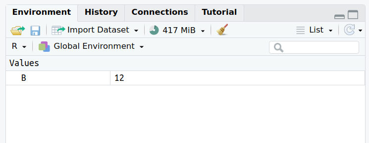

# R basics

In this section, we will cover very basic notions to understand a bit how R works.

## Arithmetic operators

R is a programming language with a statistics focus. While it can be used for very complex tasks, it can also be used as a simple calculator, as shown previously.

The following arithmetic operators can be used:

| Operator  | Function      |
|:--------: |:-------------:|
|     +     | addition      |
|     -     | subtraction   |
|     /     | division      |
|     *     | multiplication|
|  ^ or **  | exponential   |

In the R terminal, as you have seen before, you can type the following:

```{r, eval=TRUE}
10-2
```

And hit **Enter** for R to interpret the command, and give you the output.

Then try the following:

```{r, eval=F}
3*5
```

or:

```{r, eval=F}
(4*12)/5
```


## Objects in R

So far, we  used the R console interactively, and received the answers from R **in the console.**

Data/output of commands can also be stored in **object**.

Everything that stores any kind of data in R is an **object**:


## Assigning data to an object

We will use an assignment operator to **assign data to an object:**

You can use either **<-** or **=** (essentially the same).

Examples:

* Assigning/storing **10** to the object named **B**:

Copy-paste the following in the console, and hit Enter.

```{r}
B <- 10
```

This time, there is no output. If you now click **B** in the R console, and hit Enter, what happens?

* Reassigning: modifying the content of an object:

```{r, eval=FALSE}
B <- 12
```

* You can see the objects you created in the upper right panel in RStudio that is, the environment:



**How to name an object?**

Naming an object in R is quite flexible.

You can use:

* letters (note that object names case sensitive: **A** and **a** are NOT the same)
* numbers (although the object name **cannot start with a number**)
* underscores **\_**

What you CANNOT use:

* Spaces
* Most special characters

## Data types

There are several data types in R: numbers, characters, booleans, factors, etc.

For this introduction, we will mainly see and use numbers and characters.

A character or string of characters must be assigned with **quotes ("")**, for example:

```{r}
myobject <- "training"
```

You should now see in the environment (upper-right corner) the new object called **training**.

Now try to assign the same object **without the quotes**:

```{r, eval=F}
myobject <- training
```

What happens?


