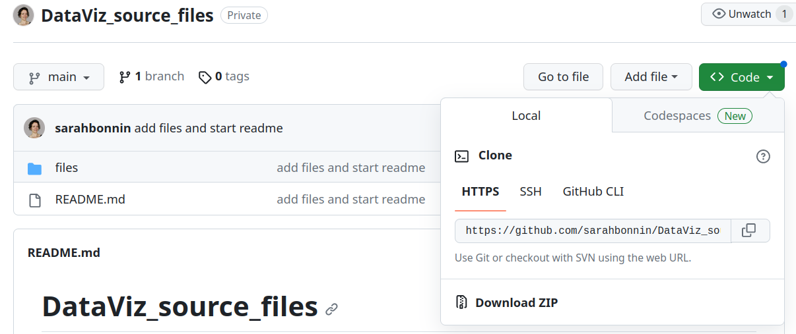
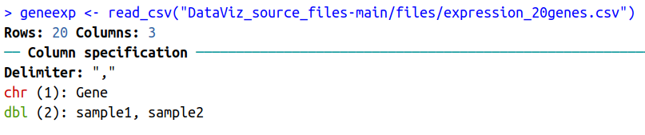
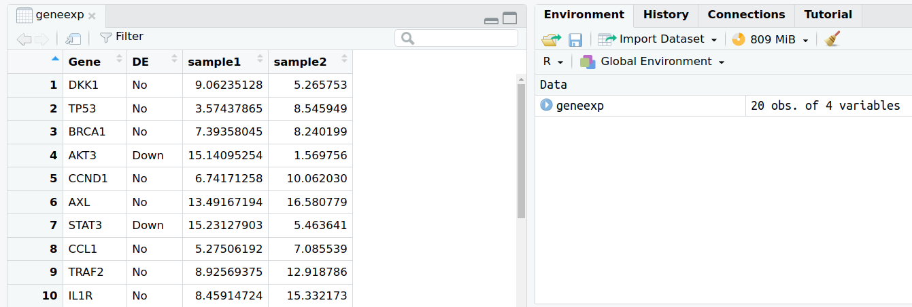

# Import data / read files / scripts

We will learn how to **import the content of a file** in R using the **{readr}** package (part of the **{tidyverse}** we previously installed).

## Fetch workshop files

First, let's copy locally a few files that were prepared for this workshop.

Go to:
https://github.com/sarahbonnin/DataViz_source_files


And download the ZIP archive, as follows:

Click on  -> Download ZIP:




Save the archive in the course folder previously created (**DataViz_2023**) and extract it (click right on the archive and you should see some extraction options).

What is extracted from the archive is the **DataViz_source_files-main** folder, which in turns contains a **files** folder: this contains the files we need for the course.

The **path** to fetch the files is the following (remember that the first piece is OS/user dependent):

*/your_home_directory/*DataViz_2023/**DataViz_source_files-main/files**

e.g.

/users/sbonnin/DataViz_2023/**DataViz_source_files-main/files**

## Import / read in data

Let's now import the content of a first file in our environment:

```{r, echo=T, eval=T, message=F, warning=F}
geneexp <- read_csv("DataViz_source_files-main/files/expression_20genes.csv")
```

Because your **working directory** is */your_home_directory/*DataViz_2023/, R can find the **DataViz_source_files-main** without requiring the whole path: this is a **relative path** as opposed to an **absolute path** .

The content of file **expression_20genes.csv** is now stored in the object named **geneexp**.

The function also outputs some information about the data you are importing:



Such as that:

* The data contains 20 rows (observations), and 4 columns (variables).
* Out of these 4 columns:
  * 2 contain characters (<span style="color: red;">chr</span>): **Gene** and **DE**.
  * 2 contain numbers (<span style="color: green;">dbl</span> for "double"): **sample1** and **sample2**

Remember that you can find the objects that you create in the **Environment** tab in the upper-right panel.

Note that if you click on an object name in the **Environment** tab, it will open on the upper-left panel. Let's try with **geneexp**:



## Scripts

A **script** is a text file containing a set of **commands** and **comments**.

It can be saved and re-used later or be shared.

It is good practice to create a script and save all commands: let's create a script for this course.

Go to File -> New File -> R script


A new window will open in the upper-left panel. Now save the file in the course folder (you can name it workshop.R)

**Save all commands you will use during the course, and save changes regularly!**


