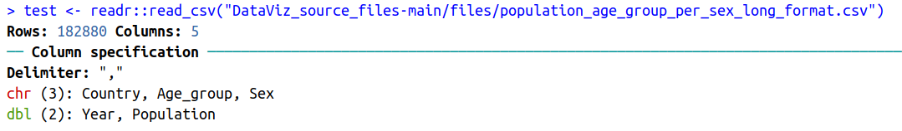

# Import data / read files

We will learn how to **import the content of a file** in R using the {readr} package (part of the {tidyverse}, that was previously installed).

## Fetch workshop files

First, let's copy locally a few files that we will need for this workshop.

Please go to:
https://github.com/sarahbonnin/DataViz_source_files


And download the ZIP archive, as follows:

Click on  -> Download ZIP:


Save the archive in the course folder previously created (**DataViz_2023**) and extract it (click right on the archive and you should see some extraction options).

What is extracted from the archive is the "DataViz_source_files-main" folder, which in turns contains a "files" folder: this contains the files we need for the course.

The **path** to fetch the files is the following (remember that the first piece is OS/user dependent):

/users/sbonnin/**DataViz_source_files-main/files**

## Import / read in data

Let's now import the content of a first file in our environment:

```{r, echo=T, eval=T, message=F, warning=F}
datapopulation <- read_csv("DataViz_source_files-main/files/population_age_group_per_sex_long_format.csv")
```

The content of file "population_age_group_per_sex_long_format.csv" is now stored in the object named **datapopulation**.

The function also outputs some information about the data you are importing:



Such as that:

* The data contains 182880 rows (observations), and 5 columns (variables).
* Out of these 5 columns:
  * 3 contain characters (<span style="color: red;">chr</span>)
  * 2 contain numbers (<span style="color: green;">dbl</span> for "double")


