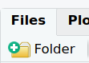
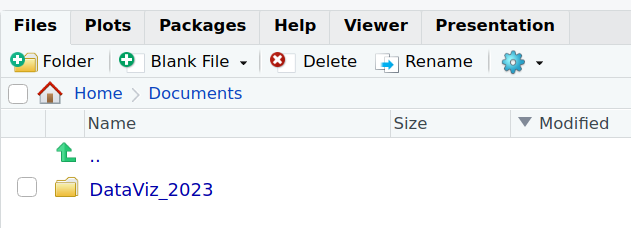
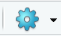

# Paths and directories

* The path of a file/directory is its **location/address** in the file system.

* Your home directory is the one that hosts your personal folder, and it should be similar to all operating system.

Let's go to the Files tab in the bottom-right corner: you can navigate this tree of files and directories by double clicking one folder name, to enter it, and by clicking on the double dot ".." to go one directory "up".

Choose the folder under which you would like to save the workshop's work.

For example, under Home -> Documents. Click on "Home" and then on "Documents":

Create a folder called "DataViz_2023" by clicking on the "+Folder" icon.

You should now see a new folder:

Double-click on the newly created "DataViz_2023" folder, still under the "Files" tab. 

Click on the "More file commands button": 

Click on "Set As Working Directory":

The working directory is where R will, by default, read and write files.

