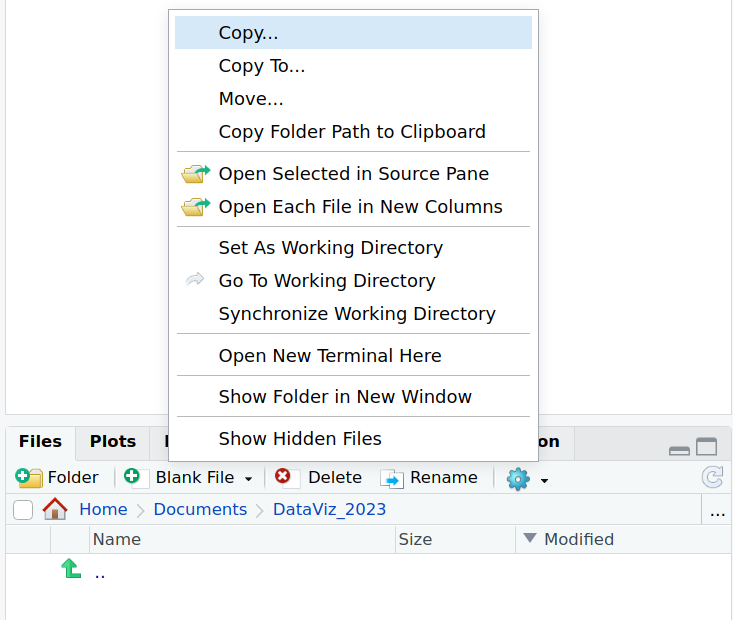

# Paths and directories

## Path and home directory

* The path of a file/directory is its **location/address** in the file system.

* Your home directory is the one that hosts the **user (you) data**: it should be similar to all operating system, for example:
  * */users/sbonnin* (Linux)
  * */Users/sbonnin* (macOS)
  * *C:\Users\sbonnin* (Windows)

## Create course directory
.
Go to the **Files** tab in the bottom-right corner: you can navigate through the *tree* of files and directories by double clicking one folder name, to enter it, and by clicking on the **double dot ".."** to go back.

Choose the folder under which you would like to save the workshop's work.

For example, you can create a new folder under **Home -> Documents**. Click on "Home" and then on "Documents":

Create a folder called **"DataViz_2023"** by clicking on the **"+Folder"** icon.

You should now see a new folder:

Double-click on the newly created "DataViz_2023" folder, still under the "Files" tab. 

Click on the **"More file commands button"**: 

Click on **"Set As Working Directory"**:

The [working directory](https://en.wikipedia.org/wiki/Working_directory) is where R will, by default, find files to read, and that is where it will also save files and figures, if not specified otherwise.

